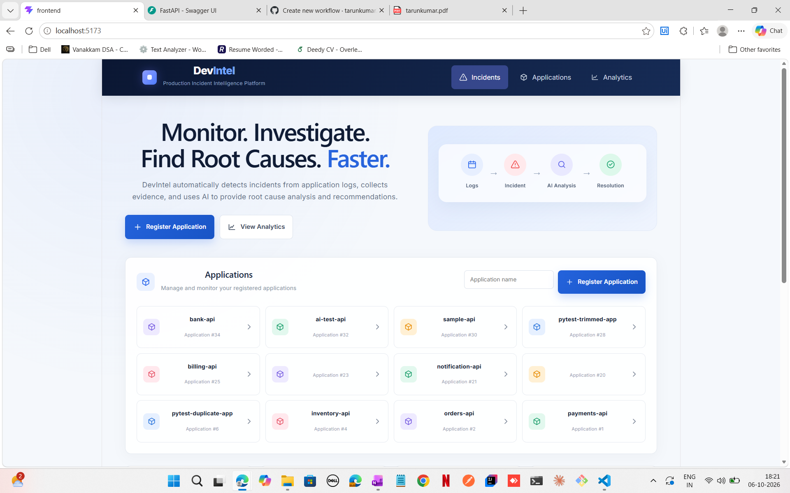
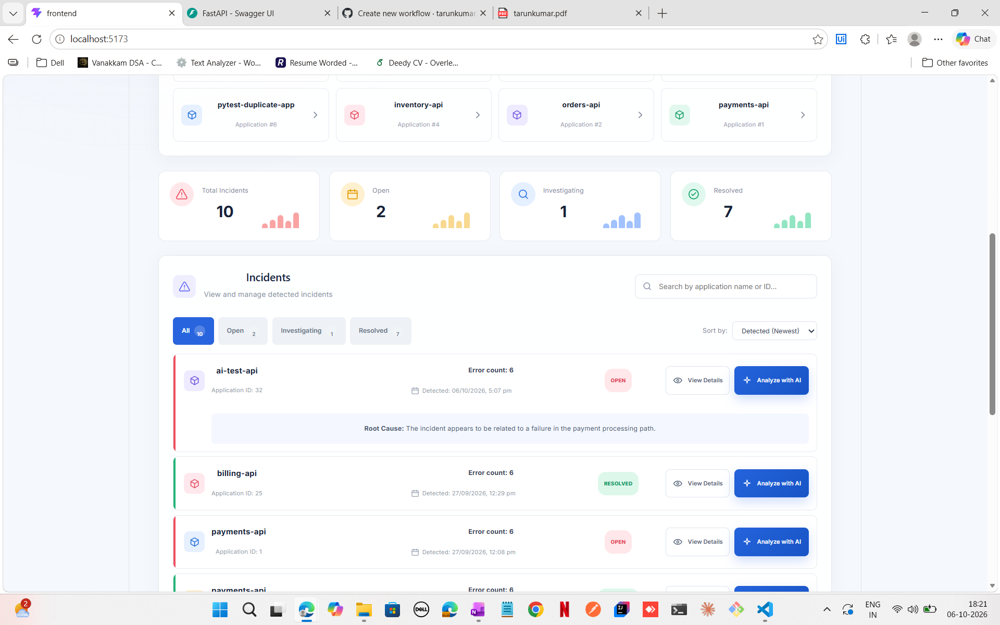
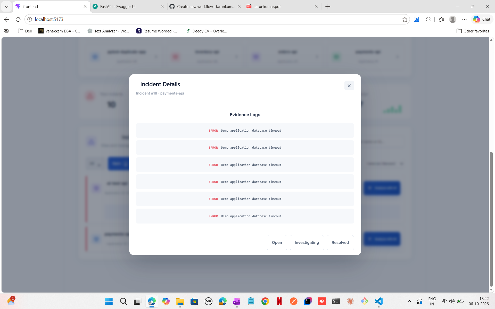
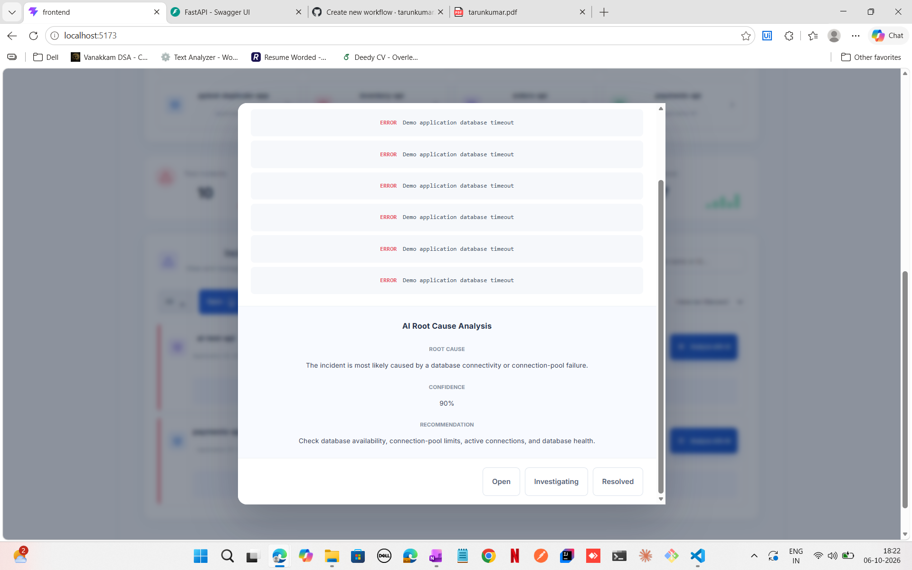

# DevIntel — AI-Powered Production Incident Intelligence

DevIntel is a production incident intelligence platform that ingests application logs, detects error spikes, creates incidents, collects evidence, and performs AI-powered Root Cause Analysis (RCA).

## Screenshots

<p align="center">
  
  
</p>

<p align="center">
  
  
</p>

## Features

- Application registration
- Application log ingestion
- Automatic error-spike detection
- Incident creation and lifecycle management
- Incident evidence retrieval
- AI-powered Root Cause Analysis
- Confidence scoring
- Evidence-based recommendations
- Historical incident retrieval and RAG
- PostgreSQL persistence
- React dashboard
- Automated testing
- GitHub Actions CI
- Docker-based deployment
- Azure cloud architecture
- Terraform infrastructure
- Security and observability

## Architecture

```text
React Frontend
     |
     v
FastAPI Backend
     |
     v
PostgreSQL
     |
     v
Incident Detection
     |
     v
Incident Evidence
     |
     v
AI / RAG / RCA
     |
     v
PostgreSQL
```

DevIntel follows a modular monolith architecture, keeping the system simple while separating application management, log ingestion, incident detection, and AI/RCA responsibilities.

## Incident Detection

An incident is created when:

- More than 5 ERROR logs
- Occur within 5 minutes
- For the same application
- No active incident already exists

```text
Open → Investigating → Resolved
```

## AI RCA Flow

```text
Incident
   ↓
Evidence Logs
   ↓
Incident Context
   ↓
Embeddings
   ↓
Historical Incident Retrieval
   ↓
RAG
   ↓
RCA
   ↓
Root Cause + Confidence + Evidence + Recommendation
```

## Tech Stack

| Area | Technology |
|------|------------|
| Backend | Python, FastAPI |
| Frontend | React |
| Database | PostgreSQL |
| ORM | SQLAlchemy |
| Testing | Pytest |
| AI | LLM, Embeddings, RAG |
| CI/CD | GitHub Actions |
| Containers | Docker |
| Cloud | Azure |
| Infrastructure | Terraform |

## Testing

```bash
python -m pytest
```

## Project Evolution

```text
v0.1 → Log Ingestion + Incident Detection
  ↓
v0.2 → Incident Lifecycle
  ↓
MVP → Applications + Evidence + Testing
  ↓
AI Version → RCA + Embeddings + RAG
  ↓
Production Version → Docker + CI/CD + Azure + Terraform
```

## Demo

The demo application can generate normal and failure logs:

```bash
python demo_app/main.py normal
python demo_app/main.py failure
```